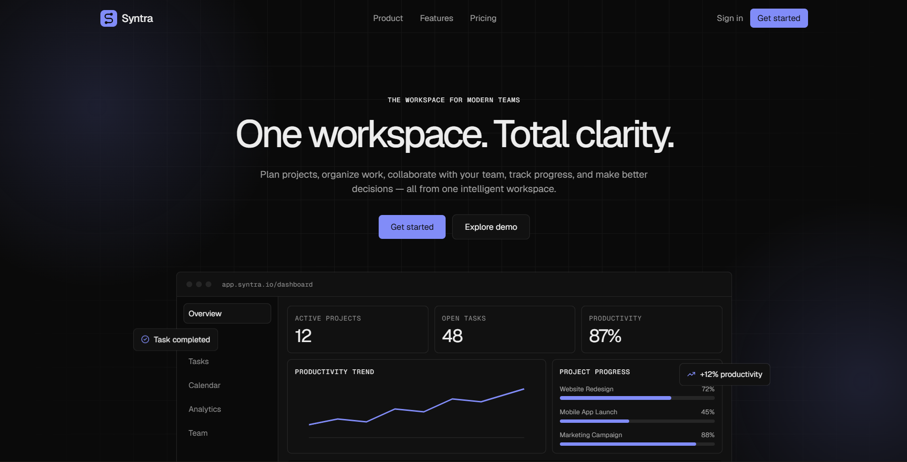
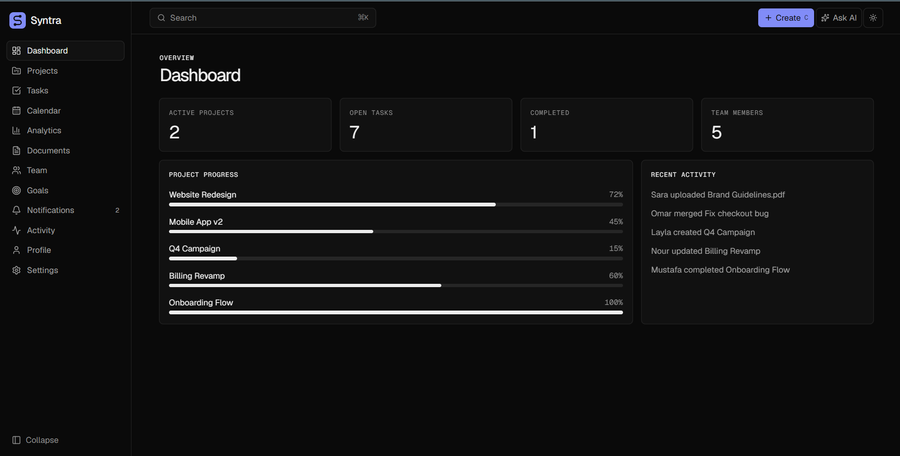
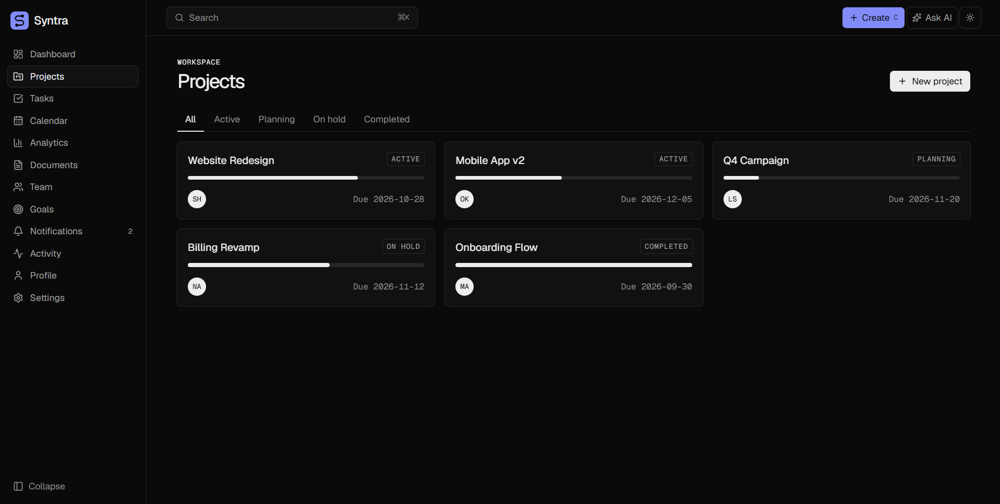
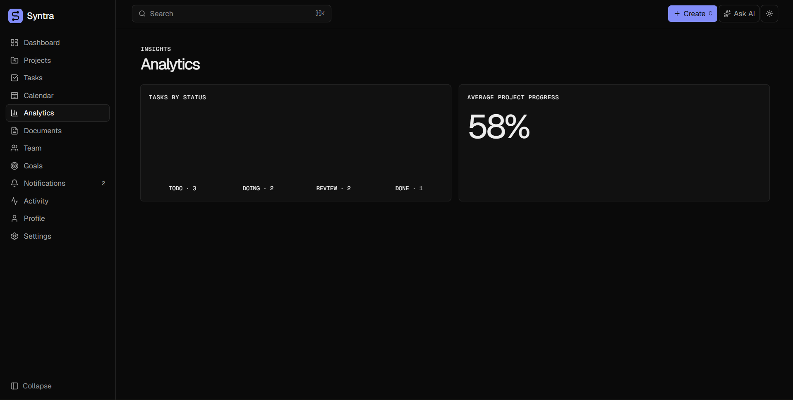
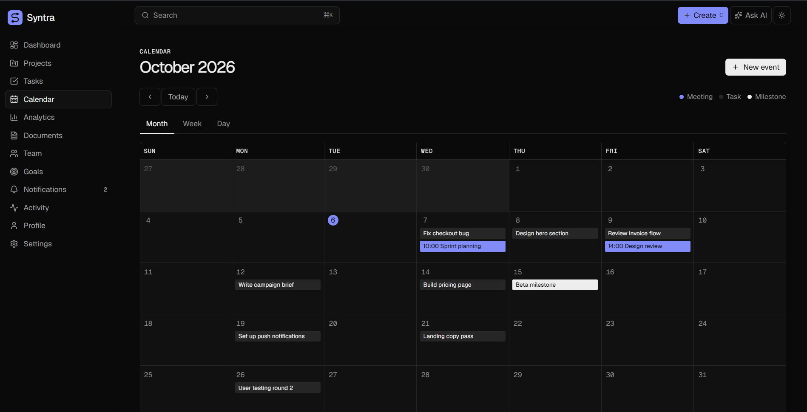
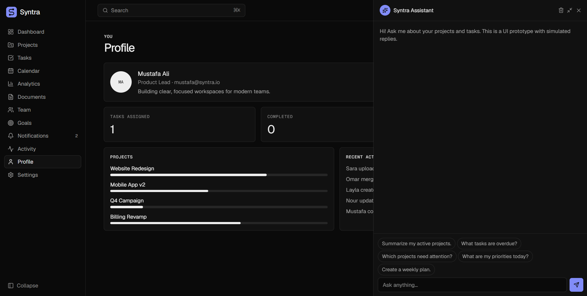

# Syntra — SaaS Workspace & Productivity Platform

> **One workspace. Total clarity.**

Syntra is a modern SaaS workspace designed to bring projects, tasks, collaboration, analytics, documents, goals, and productivity tools into one unified experience.

The project was built as a Front-End focused SaaS product to practice building a complete, realistic web application rather than a simple landing page or dashboard.

## 🌐 Live Demo

Experience the deployed version of Syntra:

[Syntra — Live Demo](https://syntra-saas-workspace.vercel.app/)

---

## 📌 Overview

Syntra combines project management, task management, team collaboration, analytics, documents, goals, and productivity features into a single workspace.

The goal was to create an application that feels like a real SaaS product, with:

- A professional marketing website
- Authentication flows
- Workspace onboarding
- Dashboard and productivity overview
- Project and task management
- Kanban workflows
- Calendar management
- Analytics and reporting
- Documents and knowledge organization
- Team collaboration
- Goals and milestones
- Notifications and activity tracking
- Global search
- Command palette
- AI Assistant interface
- Responsive design
- Dark mode
- Micro-interactions and animations

---

## ✨ Key Features

### 🏠 Landing Page

A complete SaaS marketing website including:

- Hero section
- Product preview
- Feature showcase
- Problem → Solution section
- Interactive product demonstrations
- Productivity statistics
- Analytics showcase
- Team collaboration section
- AI Assistant showcase
- Security & privacy section
- Pricing section
- FAQ accordion
- Final CTA
- Professional footer

---

### 🔐 Authentication

Complete authentication UI including:

- Sign In
- Sign Up
- Forgot Password
- Reset Password
- Social login interface
- Form validation
- Loading states
- Error states
- Success feedback

---

### 🚀 Workspace Onboarding

A multi-step onboarding experience designed to simulate the setup of a real SaaS workspace.

Users can configure:

- Workspace name
- Workspace type
- Team information
- Initial preferences
- Workspace setup

---

### 📊 Dashboard

The main workspace provides a centralized productivity overview.

Features include:

- Productivity summary
- Recent projects
- Upcoming tasks
- Calendar overview
- Productivity widgets
- Project health
- Milestones
- Recent activity
- Notifications
- Quick actions

---

### 📁 Project Management

Projects include:

- Project overview
- Project status
- Progress tracking
- Milestones
- Tags
- Project health
- Team members
- Activity
- Recent tasks

---

### ✅ Task Management

Task management includes:

- Task creation
- Priorities
- Assignees
- Due dates
- Status
- Tags
- Checklists
- Dependencies
- Attachments UI
- Task details
- Filtering and sorting

---

### 🗂️ Kanban Board

A visual workflow for managing tasks.

Features include:

- Drag-and-drop tasks
- Status columns
- Priority indicators
- Assignees
- Due dates
- Work-in-progress awareness
- Task cards
- Quick task creation

---

### 📅 Calendar

A dedicated calendar experience for organizing work.

Includes:

- Events
- Tasks
- Meetings
- Deadlines
- Event categories
- Current-time indicator
- Calendar navigation
- Scheduling interface

---

### 📈 Analytics

Syntra provides a productivity analytics experience including:

- Productivity score
- Work distribution
- Project health
- Team performance
- Task completion
- Productivity trends
- Visual charts
- Performance summaries

Charts and visualizations are designed to make project and productivity data easier to understand.

---

### 📄 Documents

A centralized space for workspace documentation.

Features include:

- Documents
- Recent documents
- Favorites
- Categories
- Search
- Document previews
- Organization interface

---

### 👥 Team Collaboration

Team management features include:

- Team members
- Roles
- Workload overview
- Invitations UI
- Member profiles
- Activity
- Collaboration indicators

---

### 🎯 Goals & Milestones

Users can manage long-term objectives through:

- Goals
- Progress tracking
- Milestones
- Status
- Deadlines
- Goal categories

---

### 🔔 Notifications & Activity

Syntra includes a notification and activity system for keeping users updated.

Features include:

- Grouped notifications
- Task updates
- Project updates
- Team activity
- Mentions
- Deadlines
- Recent workspace activity

---

### 🤖 AI Assistant

Syntra includes an AI Assistant interface designed as part of the product experience.

The interface demonstrates how an AI-powered productivity assistant could be integrated into a SaaS workspace.

Examples include:

- Workspace questions
- Productivity suggestions
- Task-related conversations
- Project summaries
- Quick actions
- Contextual assistance

> **Important:** The AI Assistant is currently a simulated Front-End experience.
> It does not use a real LLM, RAG system, AI agent, vector database, or AI backend.

The feature was intentionally designed as a UI concept while keeping the project focused on Front-End development.

---

## ⚡ Productivity Features

Syntra also includes several productivity-focused interactions:

- Quick Create
- Global Search
- Command Palette
- Keyboard-friendly navigation
- Contextual empty states
- Skeleton loaders
- Toast notifications
- Hover interactions
- Micro-interactions
- Page transitions

These features help the application feel closer to a real production SaaS platform.

---

## 🎨 Design Direction

Syntra's visual direction was inspired by modern SaaS products and design systems.

Primary inspiration:

- Linear

Secondary inspiration:

- Stripe
- Vercel
- Notion
- Figma

The goal was not to copy any specific product, but to study modern SaaS design principles and create an original visual identity for Syntra.

### Design Principles

- Minimal
- Professional
- Premium
- Clear visual hierarchy
- Consistent spacing
- Strong typography
- Subtle borders
- Carefully used color
- Smooth interactions
- Responsive layouts
- Accessible UI

---

## 📸 Product Screenshots

### Landing Page



### Dashboard



### Project Management



### Analytics



### Calendar



### AI Assistant



---

## 🛠️ Tech Stack

### Front-End

- React
- Vite
- JavaScript
- Tailwind CSS
- React Router

### UI & Icons

- Lucide React
- Custom reusable UI components
- Responsive layouts
- CSS animations and transitions

### Data Visualization

- Recharts

### Interaction & Utilities

- dnd-kit
- date-fns
- React Hook Form

### Optional State / Backend Architecture

The project structure is designed so that state management and backend services can be introduced later when required.

Potential future integrations include:

- Zustand
- Supabase
- Authentication backend
- Database
- API layer
- Real AI services

---

## 🧱 Application Structure

```text
Syntra
│
├── Landing Page
│
├── Authentication
│   ├── Sign In
│   ├── Sign Up
│   ├── Forgot Password
│   └── Reset Password
│
├── Onboarding
│
└── Workspace
    │
    ├── Dashboard
    ├── Projects
    ├── Tasks
    ├── Kanban
    ├── Calendar
    ├── Analytics
    ├── Documents
    ├── Team
    ├── Goals
    ├── Notifications
    ├── Activity
    ├── AI Assistant
    ├── Profile
    └── Settings
```

---

## 🚀 Getting Started

1. Clone the repository

```bash
git clone https://github.com/YOUR-USERNAME/Syntra-SaaS-Workspace.git
```

2. Navigate into the project

```bash
cd Syntra-SaaS-Workspace
```

3. Install dependencies

```bash
npm install
```

4. Start the development server

```bash
npm run dev
```

The application will then be available through the local development server provided by Vite.

---

## 🎯 Project Goals

The main goals of Syntra were to practice:

- Building a complete SaaS product
- React application architecture
- Component-based development
- Responsive UI development
- Modern SaaS UX
- Routing and application flows
- State management concepts
- Data visualization
- Drag-and-drop interactions
- Form handling
- Product-oriented Front-End development
- Creating realistic product experiences
- Building a portfolio-ready project

The project also helped bridge the gap between simply writing Front-End code and thinking about how a real digital product is structured.

---

## 🧠 What I Learned

Through Syntra, I focused on improving my understanding of:

- React
- Component architecture
- Reusable UI systems
- Responsive design
- SaaS product structure
- User experience
- Application navigation
- Interactive interfaces
- Data visualization
- Front-End state management
- Building realistic mock data
- Designing scalable project structures

Most importantly, the project helped me move from building isolated pages to thinking about the complete user experience of a product.

---

## 🔮 Future Improvements

Potential future versions of Syntra could introduce:

- Real authentication
- Database integration
- Real-time collaboration
- Persistent user workspaces
- Backend APIs
- Real notifications
- File storage
- Advanced permissions
- Real analytics data
- Email notifications
- Mobile application
- Real AI Assistant
- LLM integration
- RAG-powered workspace search
- AI-powered task and project insights

These features are intentionally outside the current Front-End-focused scope.

---

## 👨‍💻 Author

**Mustafa Mekky**
ECE Engineering Student
Front-End Developer | Building with Python | Exploring AI & Machine Learning

---

## 📄 License

This project was created for educational, portfolio, and learning purposes.

If you use ideas or components from this project, please provide appropriate attribution where applicable.
